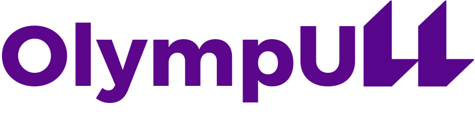

# OlympULL: Aplicación de gestión de torneos

## Introducción

### ¿Qué es OlympULL?

Olympull es una aplicación de escritorio escrita en Java que ha sido desarrollada como Trabajo de Fin de Grado en el Grado de Ingeniería Informática de la Universidad de La Laguna.

Este programa sirve para la gestión de torneos por puntos, en los que los participantes van obteniendo puntos según su desempeño en diferentes ejercicios sin enfrentamientos directos entre ellos.

En concreto, este programa ha nacido ante la necesidad de un software de gestión para la Olimpiada de Pensamiento Computacional, un evento celebrado cada año en la Escuela Superior de Ingeniería y Tecnología de la Universidad de La Laguna, que tiene como objetivo incentivar las vocaciones científicas entre niños y niñas de centros de Primaria y Secundaria de la isla de Tenerife.

### ¿Qué puedo hacer con OlympULL?
Los torneos de la Olimpiada de Pensamiento Computacional están compuestos por itinerarios, que son los diferentes conjuntos o circuitos de ejercicios a los que se van a enfrentar los equipos de participantes.

Con OlympULL, la gestión de estos elementos, las relaciones entre ellos y el recuento de puntos serán tareas mucho más sencillas.

Se consideran tres tipos de usuarios:
* **Administradores.** Son los usuarios que más funcionalidades pueden realizar dentro de la aplicación. Estos pueden realizar dos tipos de gestiones:
  - **Gestión de olimpiadas.** Se trata de la creación y gestión de las olimpiadas, los itinerarios, los ejercicios, las rúbricas, los equipos y las relaciones entre todos estos elementos.
  - **Gestión de usuarios.** Se refiere a la creación y gestión de los usuarios de la aplicación, así como las relaciones entre ellos y los diferentes elementos de las olimpiadas.

* **Organizadores.** Son las personas encargadas de cada itinerario. Pueden añadir ejercicios a sus itinerarios.
 
* **Monitores.** Son las personas encargadas de cada ejercicio. Pueden puntuar a los equipos que participen en los ejercicios que tengan asignados.

Además, independientemente del tipo de usuario que seas, incluso si no estás dado de alta en la aplicación, puedes consultar el ranking de cada ejercicio.

### ¿Qué necesito para utilizar OlympULL?
Para poder utilizar OlympULL, necesitas las siguientes tecnologías:

#### En mi máquina local
* Java 17.0.8 o superior.

#### En mi máquina remota
* MySQL 8.0.36 o superior.

---

## Guía de inicio rápido
A continuación, se describen los pasos a seguir para poder utilizar este software, desde su instalación hasta la ejecución del mismo.

### **Instalación**
* Instala la versión de Java requerida en tu máquina local (si no la tienes).
* Instala la versión de MySQL requerida en tu máquina remota (si no la tienes).
* Descarga este repositorio en tu máquina local.

### **Configuración**
* El archivo [config.properties](src/main/resources/config.properties) contiene la información necesaria para poder establecer la conexión entre la máquina local y la base de datos de la máquina remota. Define las propiedades (como la información de puertos, direcciones IP y credenciales) requeridas para poder interconectar tus máquinas.
* El archivo [create-database.sql](src/main/resources/create-database.sql) contiene las sentencias SQL necesarias para crear las tablas correspondientes en la base de datos de tu máquina remota. [ScriptRunner.java](/src/java/ScriptRunner.java) te permitirá ejecutar este script de forma automática para montar la base de datos fácilmente y sin tener que realizar ningún trabajo manual. 

### **Uso básico**
Una vez descargado y configurado, puedes ejecutar el programa tanto desde tu IDE favorito como mediante un archivo ejecutable JAR.

Para generar el JAR, simplemente utiliza el comando <code>mvn package</code> en el directorio raíz del proyecto. Cuando termine el proceso, el ejecutable aparecerá en el subdirectorio <code>/target</code>.

¡Ya puedes comenzar a usar OlympULL!

La primera vez que inicies sesión en la aplicación, deberás introducir las siguientes credenciales:
- Usuario: ADMIN1
- Contraseña: ADMIN1

Estas credenciales te permitirán iniciar sesión como administrador. Posteriormente, podrás cambiarlas, o incluso crear otros usuarios de tipo administrador para gestionar la Olimpiada.

### **Recursos Adicionales**
* Se recomienda instalar la fuente de texto Argentum, que es la que se ha establecido en el programa para los elementos de la interfaz gráfica. Puedes encontrarla en el directorio [/fonts](/fonts) de este repositorio.
* El archivo [data.properties](src/main/resources/data.properties) contiene la ruta y los nombres de los archivos de *back-up* donde se van a exportar los datos de la base de datos, y de los que se pueden extraer datos para insertar en ella. Ya se han establecido unos nombres por defecto, pero puedes cambiarlos por otros que te gusten más, si así lo prefieres.

### **Distribución a organizadores y monitores**
La distribución de la aplicación a los usuarios organizadores y monitores se hará mediante un archivo JAR. Una vez hayan sido dados de alta en la aplicación, podrán iniciar sesión y comenzar a utilizar OlympULL tras haberles facilitado sus credenciales.

Las credenciales establecidas en las propiedades <code>ssh_user</code>, <code>ssh_password</code>, <code>db_user</code> y <code>db_password</code> de [config.properties](src/main/resources/config.properties) representan el usuario y la contraseña necesarios para acceder a la máquina remota y a la base de datos MySQL de la misma, respectivamente. Para asegurar que no se hagan modificaciones maliciosas o indeseadas sobre cualquiera de ellas, mientras que los administradores deberían poder tener el control absoluto de ambas, se recomienda encarecidamente la creación de usuarios con permisos limitados y la incorporación de las credenciales de estos nuevos usuarios en [config.properties](src/main/resources/config.properties) antes de distribuir un ejecutable de OlympULL a los organizaodres y monitores, puesto que toda la información de inicio de sesión puede ser fácilmente accesible si se inspeccionan los contenidos del JAR.

---

## Licencia
Este proyecto está licenciado bajo la [Licencia Creative Commons Atribución-NoComercial-SinDerivadas 4.0 Internacional](LICENSE.md).

